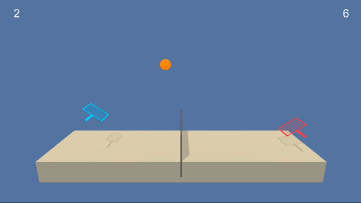
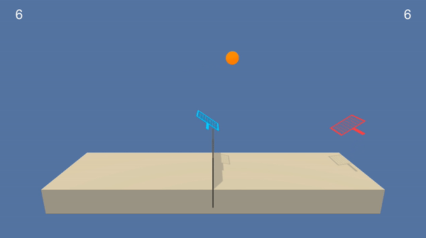
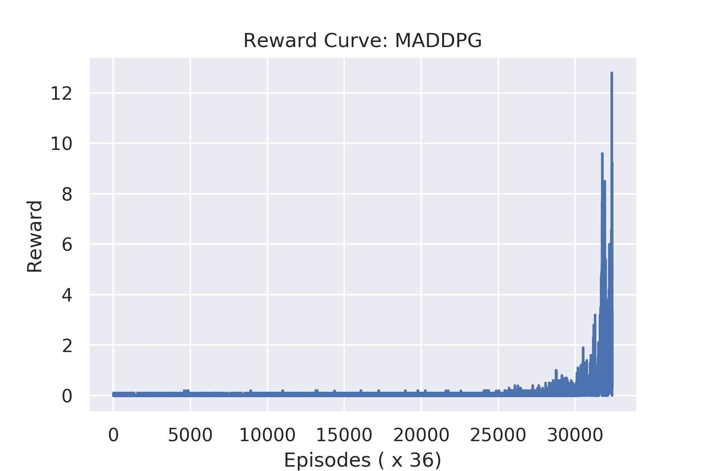
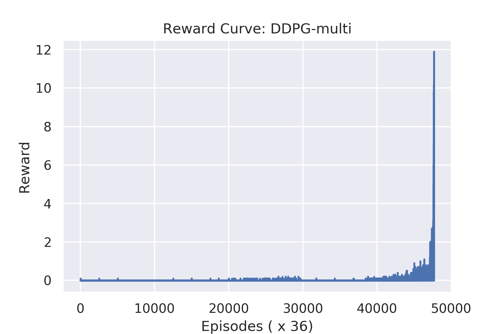

# About
Training a pair of competing RL agents to play Tennis using [MADDPG](https://arxiv.org/abs/1706.02275) algorithm. 

The environment requires the agents to learn **both competitive and cooperative strategies** in order to maximize their respective cummulative rewards.

## Table of Contents

* [Trained Agent Demo](#trained-agent-demo)
* [Tennis Unity Environment](#tennis-unity-environment)
* [Setup](#setup)
    * [System Configuration](#system-configuration)
    * [Environment Setup](#environment-setup)
    * [Instructions for getting started](#instructions-for-getting-started)
    * [Project Structure](#project-structure)
* [Algorithm Details](#algorithm-details)
* [Reward Curve](#reward-curve)
* [Bibliography](#bibliography)

## Trained Agent Demo

* Single ddpg agent with shared actor and critic model for both players


* Separate DDPG agents with independent actor and critic models


## Tennis Unity Environment

* Set-up: Two-player game where agents control rackets to bounce ball over a
  net.
* Goal: The agents must bounce ball between one another while not dropping or
  sending ball out of bounds.
* Agents: The environment contains two agent linked to a single Brain named
  TennisBrain. After training you can attach another Brain named MyBrain to one
  of the agent to play against your trained model.
* Agent Reward Function (independent):
  * +0.1 To agent when hitting ball over net.
  * -0.01 To agent who let ball hit their ground, or hit ball out of bounds.
* Brains: One Brain with the following observation/action space.
  * Vector Observation space: 8 variables corresponding to position and velocity
    of ball and racket.
  * Vector Action space: (Continuous) Size of 2, corresponding to movement
    toward net or away from net, and jumping.
  * Visual Observations: None.
* Reset Parameters: One, corresponding to size of ball.
* Benchmark Mean Reward: 2.5


# Setup

## System Configuration
The project was built with the following configuration:

* Ubuntu 16.04
* CUDA 10.0
* CUDNN 7.4
* Python 3.6 (currently ml-agents unity package does not work with python=3.7)
* Pytorch 1.0

Though not tested, the project can still be expected to work out of the box for most reasonably deviant configurations.

## Environment Setup

* Create separate virtual environment for the project using the provided `environment.yml` file
```
conda create -f environment.yml
conda activate tennis
```

## Instructions for getting started!

1. Clone the repository (if you haven't already!)
```bash
git clone https://github.com/1jsingh/rl_tennis.git
cd rl_tennis
```

2. Download the environment from one of the links below.  You need only select the environment that matches your operating system:

    
    - Linux: [click here](https://drive.google.com/open?id=1i-qpk2KX2ZAjGWL9PMePhG7a6oaQ8aMV)
    - Mac OSX: [click here](https://drive.google.com/open?id=1uJc9juUlC2OmMMD6extaQnC2HhuJbcXN)

    (_For AWS_) If you'd like to train the agent on AWS (and have not [enabled a virtual screen](https://github.com/Unity-Technologies/ml-agents/blob/master/docs/Training-on-Amazon-Web-Service.md)), then please use [this link](https://drive.google.com/open?id=1VAE9YsjjJzJjUKVUR_OLsfXL2KipqcV_) to obtain the "headless" version of the environment.  You will **not** be able to watch the agent without enabling a virtual screen, but you will be able to train the agent.  (_To watch the agent, you should follow the instructions to [enable a virtual screen](https://github.com/Unity-Technologies/ml-agents/blob/master/docs/Training-on-Amazon-Web-Service.md), and then download the environment for the **Linux** operating system above._)
       
3. Place the downloaded file in the `unity_envs` directory and unzip it.
  ```
  mkdir unity_envs && cd unity_envs
  unzip Tennis_Linux.zip
  ```

4. Follow along with `maddpg/Tennis-maddpg.ipynb` to train your own RL agent. 


## Project Structure

Besides the MADDPG algorithm the repo also contains 2 other solutions for the Tennis Unity environment:

* `maddpg`: implementation of the [MADDPG](https://arxiv.org/abs/1706.02275) algorithm consisting independent but centralized critic for each agent with access to combined action and observation states of all agents.
* `ddpg`: single ddpg agent with shared actor and critic model for the 2 players
* `ddpg_multi`: separate DDPG agents with independent actor and critic models
* `unity_envs`: directory for downloading and storing the unity envs for your system
* `trained_models`: directory for storing trained models

# Algorithm Details

The Multi Agent Deep Deterministic Policy Gradient (**MADDPG**) algorithm consists of multiple agents with separate actor and critic models. Unlike multiple DDPG models (refer `ddpg_multi`), MADDPG requires that all critics have access to the combined action and observation space of all agents. Doing so, enables the agents to coordinate in a much more sophisticated fashion than independent DDPG agents.

For **comparison** purposes, the repo also contains 2 separate solutions to the tennis unity environment

* **DDPG** : Using the fact that environment is highly symmetrical, this solution tries to use the same DDPG agent for both the players.
* **DDPG-multi**: This is the standard point of comparison to the MADDPG algorithm. The solution consists of using separate and decentralized DDPG agents for the 2 players.

## Reward Curve

* **MADDPG**
  

* **DDPG-multi**: multiple DDPG agents with independent actor and critic models
  

# Bibliography

1. <cite>Lowe, Ryan, et al. "Multi-agent actor-critic for mixed cooperative-competitive environments." Advances in Neural Information Processing Systems. 2017.</cite>
2. <cite>Learning to Cooperate, Compete, and Communicate: https://openai.com/blog/learning-to-cooperate-compete-and-communicate/</cite>